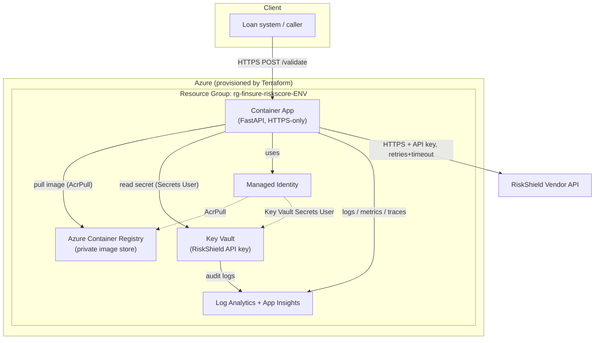

# Vendor Payment Risk Scoring Integration

A secure, production-ready integration platform that validates loan applicants
against the **RiskShield** vendor API and returns a risk score. Built for the
Pollinate Platform Engineering Technical Assessment.

---

## What it does

`POST /validate` accepts applicant details, calls the RiskShield risk-scoring API
(securely, with retries and timeouts), and returns the risk score.

```http
POST /validate
{ "firstName": "Jane", "lastName": "Doe", "idNumber": "9001011234088" }

200 OK
{ "riskScore": 72, "riskLevel": "MEDIUM" }
```

---

## Architecture



**Flow:** the caller hits the Container App over HTTPS → the app authenticates to
Azure using its **Managed Identity** → reads the RiskShield API key from **Key
Vault** → calls the vendor with resilience (timeout, retry, correlation ID) →
returns the score. Everything is observed via **Log Analytics / App Insights**.

---

## Repository layout

```
.
├── app/                # FastAPI service + tests + Dockerfile
│   ├── app/            #   application code (config, models, client, secrets, logging)
│   ├── tests/          #   pytest suite (8 tests)
│   └── Dockerfile      #   multi-stage, non-root, healthcheck
├── terraform/          # Infrastructure as Code (modular, dev/prod)
│   ├── bootstrap/      #   one-time remote-state storage
│   ├── modules/        #   resource_group, observability, acr, identity, key_vault, container_app
│   └── environments/   #   dev/prod tfvars + backend configs
├── pipelines/          # Azure DevOps CI/CD (build → infra → deploy)
│   └── templates/      #   reusable build/infra/deploy stage templates
└──
```

---

## Tech choices

| Area | Choice | Why |
|------|--------|-----|
| Language | **Python + FastAPI** | Fast to write, auto-validation, built-in API docs |
| Compute | **Azure Container Apps** | Serverless containers, scale-to-zero, managed HTTPS |
| IaC | **Terraform** (modular) | Reusable, reviewable, multi-env |
| Secrets | **Key Vault + Managed Identity** | No passwords anywhere |
| CI/CD | **Azure DevOps** | Required; templated, gated prod |
| Observability | **Log Analytics + App Insights** | Logs, metrics, tracing |

---

## Run locally

```powershell
cd app
python -m venv .venv
.\.venv\Scripts\Activate.ps1
pip install -r requirements.txt -r requirements-dev.txt

# Run in mock mode (no vendor or secrets needed)
$env:USE_MOCK="true"
uvicorn app.main:app --port 8000
```

Then in another terminal:

```powershell
curl http://127.0.0.1:8000/health
curl -X POST http://127.0.0.1:8000/validate -H "Content-Type: application/json" `
  -d '{"firstName":"Jane","lastName":"Doe","idNumber":"9001011234088"}'
```

Run the tests: `pytest` (from `app/`). Run in Docker

---

## Deploy to Azure

```powershell
# 1. One-time: create remote-state storage
cd terraform/bootstrap
terraform init
terraform apply -var="subscription_id=<YOUR_SUB_ID>"

# 2. Configure dev env files (fill in subscription + storage account)
cd ..
copy environments\dev.tfvars.example environments\dev.tfvars
copy environments\dev.backend.hcl.example environments\dev.backend.hcl

# 3. Configure prod env files (fill in subscription + storage account)
cd ..
copy environments\prod.tfvars.example environments\prod.tfvars
copy environments\prod.backend.hcl.example environments\prod.backend.hcl

# 4. Provision dev
terraform init -backend-config="environments/dev.backend.hcl"
terraform plan -var-file="environments/dev.tfvars"
terraform apply -var-file="environments/dev.tfvars"

# 5. See the app URL
terraform output app_url

# 6. Destroy dev environment
terraform destroy -var-file="environments/dev.tfvars"

```

For automated deployment, set up the Azure DevOps pipeline

### Create the service connection
1. Project Settings → **Service connections** → New → **Azure Resource Manager**.
2. Choose **Workload identity federation (automatic)** (most secure) or service
   principal. Scope it to your subscription.
3. Name it **`azure-finsure`** (matches the pipeline default).

### Create the Environments + prod approval
1. Pipelines → **Environments** → New → name it **`dev`**. Repeat for **`prod`**.
2. Open **prod** → ⋯ → **Approvals and checks** → **Approvals** → add yourself.
   *This is what enforces "manual approval for prod".*

### Create the secret variable group
1. Pipelines → **Library** → **+ Variable group** → name **`riskscore-secrets`**.
2. Add variable **`RISKSHIELD_API_KEY`**, set its value, and click the **lock**
   to mark it secret. (Best practice: link the group to Key Vault instead.)

### Set the state storage name
Edit `pipelines/azure-pipelines.yml` → parameter `tfStateStorage` default → set it
to the storage account name from the bootstrap output.

### Create the pipeline
1. Pipelines → **New pipeline** → choose your repo.
2. **Existing Azure Pipelines YAML file** → select `/pipelines/azure-pipelines.yml`.
3. Run it. Approve the prod stage when prompted.

---

## 4. Security in the pipeline (what's evaluated)

- **No static credentials**: auth via service connection (federated identity).
- **Secret handling**: Is a secret variable, masked in logs,
  written straight to Key Vault — never echoed.
- **Image scanning**: Trivy scans for HIGH/CRITICAL CVEs before deploy.
- **Separate environments**: isolated dev/prod with their own state, infra, and
  approval gates.
- **Promote, don't rebuild**: the exact tested image is imported to prod, so what
  you tested is what you ship.

---

## Security considerations

- **Secrets in Key Vault**, retrieved via **Managed Identity** — none in code,
  image, or Terraform state.
- **HTTPS only**; insecure HTTP rejected at ingress.
- **Least privilege** RBAC (`AcrPull`, `Key Vault Secrets User` only).
- **Non-root, scanned, minimal** container image.
- **Diagnostic logging** to Log Analytics (incl. Key Vault audit).
- **No static credentials** in the pipeline (federated service connection).

---